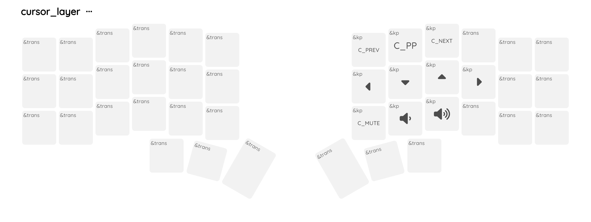

# Corne Wireless View ZMK Config

ZMK configuration for my Corne Wireless keyboard. Hardware use for the current build:

- PCB from typeractive
- NiceNano Controller
- NiceView displays

## How to update the layout

1. Use the [nickcoutsos.github.io/keymap-editor](https://nickcoutsos.github.io/keymap-editor/) to load this repository,
2. Edit the layout.
3. Use the option to `View keymap data` and copy the output.
4. Modify the local file and commit.

## Current layout

